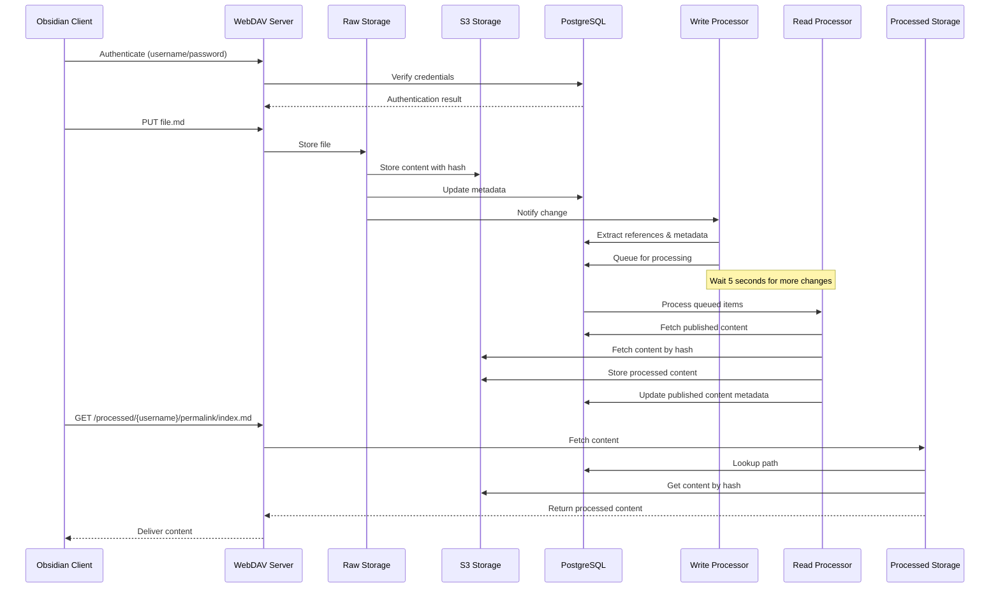

# Marble Architecture Diagram

## Component Interaction Diagram

```mermaid
graph TD
    subgraph Clients
        ObsidianClient[Obsidian Client]
        WebClient[Web Browser]
    end
    
    subgraph MarbleWebDAV[WebDAV Server]
        WebDAVRaw[Raw WebDAV Endpoint]
        WebDAVProcessed[Processed WebDAV Endpoint]
        Auth[Authentication]
    end
    
    subgraph Storage
        RawStorage[Raw Storage Backend]
        ProcessedStorage[Processed Storage Backend]
        S3[(S3 Content Storage)]
        DB[(PostgreSQL Metadata)]
    end
    
    subgraph ProcessingPipeline
        WriteProcessor[Write Processor]
        ReadProcessor[Read Processor]
        ProcessingQueue[Processing Queue]
    end
    
    subgraph ReadSide
        HTMLGenerator[HTML Generator]
        TemplateEngine[Template Engine]
    end
    
    % Client connections
    ObsidianClient -->|WebDAV Sync| WebDAVRaw
    WebClient -->|Read Published Content| WebDAVProcessed
    WebClient -->|View Website| HTMLGenerator
    
    % WebDAV Server connections
    WebDAVRaw -->|Authenticate| Auth
    WebDAVProcessed -->|No Auth Required| ProcessedStorage
    Auth -->|Verify| DB
    
    % Storage connections
    WebDAVRaw -->|Read/Write| RawStorage
    RawStorage -->|Store Content| S3
    RawStorage -->|Store Metadata| DB
    ProcessedStorage -->|Read Content| S3
    ProcessedStorage -->|Read Metadata| DB
    
    % Processing connections
    RawStorage -->|Notify Changes| ProcessingQueue
    ProcessingQueue -->|Process| WriteProcessor
    WriteProcessor -->|Extract Metadata| DB
    WriteProcessor -->|Trigger| ReadProcessor
    ReadProcessor -->|Generate| ProcessedStorage
    
    % Read Side
    WebDAVProcessed -->|Fetch Content| HTMLGenerator
    HTMLGenerator -->|Use| TemplateEngine
    
    classDef server fill:#f9f,stroke:#333,stroke-width:2px;
    classDef storage fill:#bbf,stroke:#333,stroke-width:2px;
    classDef processor fill:#bfb,stroke:#333,stroke-width:2px;
    classDef db fill:#ff9,stroke:#333,stroke-width:2px;
    classDef client fill:#ddd,stroke:#333,stroke-width:1px;
    
    class WebDAVRaw,WebDAVProcessed,Auth server;
    class RawStorage,ProcessedStorage storage;
    class WriteProcessor,ReadProcessor,ProcessingQueue processor;
    class S3,DB db;
    class ObsidianClient,WebClient,HTMLGenerator,TemplateEngine client;
```

## Data Flow Diagram


