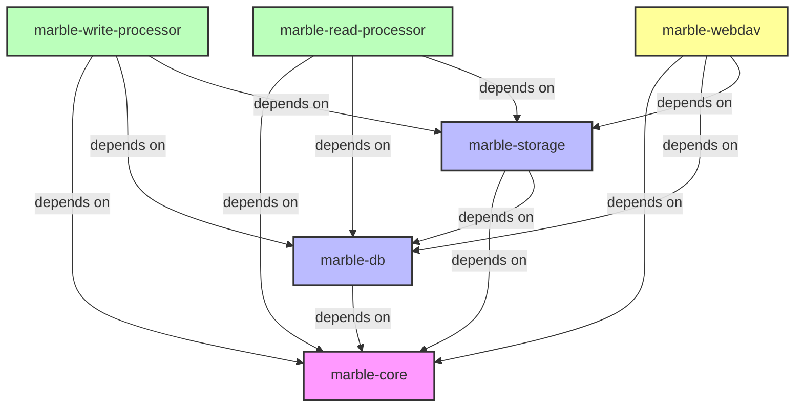

# Crate Dependencies

This document outlines the dependencies between the various crates in the Marble project.

## Dependency Graph

## Crate Descriptions

### Core Crates

- **marble-core**: Fundamental types and interfaces used across the system
  - Frontmatter definitions
  - Authentication interfaces
  - Common utilities

### Infrastructure Crates

- **marble-db**: Database schema and operations
  - PostgreSQL schema definitions
  - SQLx queries and operations
  - Migrations

- **marble-storage**: Storage abstraction
  - OpenDAL backends
  - S3 integration
  - Path mapping

### Processing Crates

- **marble-write-processor**: Content analysis and metadata extraction
  - File parsing
  - Frontmatter extraction
  - Reference identification
  - Database updates

- **marble-read-processor**: Content transformation for publishing
  - Publishing logic
  - Link transformation
  - Permalink structure generation
  - Cache generation

### Binary Crates

- **marble-webdav**: WebDAV server for client interaction
  - WebDAV protocol implementation
  - Authentication handling
  - Request routing
  - Backend integration

## Implementation Order

The suggested implementation order is:

1. **marble-core**: Establishes shared types and interfaces
2. **marble-db**: Creates database foundation
3. **marble-storage**: Implements storage layer
4. **marble-webdav**: Provides client interface
5. **marble-write-processor**: Handles content analysis
6. **marble-read-processor**: Generates published output
